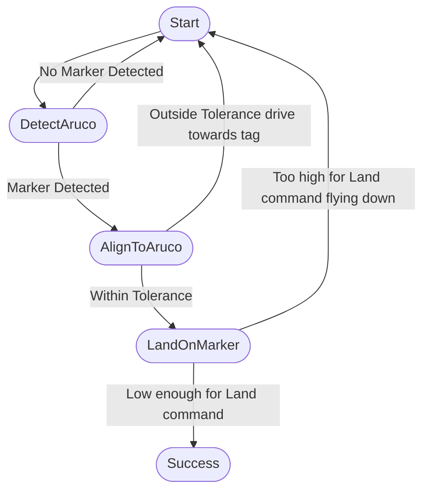

# bt_aruco_landing

A ROS 2 package for autonomous drone landing using Behavior Trees and ArUco marker detection.

## Overview

This package implements a behavior tree-based approach for landing a drone on an ArUco marker. It leverages ROS 2, OpenCV, and the BehaviorTree.CPP library to detect the marker, align the drone, and perform a safe landing.

## Features

- **Behavior Tree control** for modular and robust landing logic.
- **Custom BT nodes** for ArUco detection, alignment, and landing.
- **Integration with ROS 2 topics** for pose and image data.
- **Launch file** for easy startup.
- **Configurable behavior tree XML** for flexible mission design.

## Directory Structure

- `src/` - Source code for BT nodes and the main node.
- `include/` - Header files for BT nodes.
- `behaviour_trees/` - XML files defining the behavior trees.
- `launch/` - ROS 2 launch files.
- `CMakeLists.txt` and `package.xml` - Build and package configuration.

## Dependencies

- ROS 2 (rclcpp, sensor_msgs, geometry_msgs, tf2, tf2_ros, image_transport, cv_bridge, ament_cmake, ament_index_cpp)
- OpenCV (with ArUco module)
- BehaviorTree.CPP v3
- aruco (external library, see CMakeLists.txt for path)

## Building

```bash
# From your ROS 2 workspace root
colcon build --packages-select bt_aruco_landing
source install/setup.bash
```

## Usage

To launch the behavior tree landing node:

```bash
ros2 launch bt_aruco_landing bt_landing_launch.py
```

The default behavior tree is defined in `behaviour_trees/land_tree.xml`, which performs the following sequence:

1. Detect the ArUco marker.
2. Align to the marker.
3. Land on the marker.

If any step fails, the sequence restarts from the beginning.

### Behaviour Tree Flowchart



## Customization

- Modify or create new behavior trees in the `behaviour_trees/` directory.
- Add or adjust BT nodes in `src/bt_nodes/` and `include/bt_aruco_landing/bt_nodes/`.

